# Claude Code Mastery System

🤖 **Multi-Agent Claude Code System für Web-App-Entwicklung**

## 🎯 Was ist das?

Ein vollständiges System für AI-Enhanced Software Development mit:
- **Analysis Agent:** Bug-Analyse & Feature-Planung
- **Implementation Agent:** Automatische Code-Implementierung  
- **Human-Controlled Workflow:** Kontrolle an kritischen Entscheidungspunkten
- **VS Code Integration:** Nahtlose Entwicklungsumgebung
- **Docker/Traefik:** Production-Ready Deployment

## 📚 Dokumentation

| Dokument | Beschreibung |
|----------|--------------|
| [01_Grundlagen](docs/01_Claude_Code_Grundlagen.md) | Community Best Practices & Compounding Engineering |
| [02_Commands](docs/02_Custom_Commands_Sammlung.md) | Multi-Agent Befehle & Workflows |
| [03_Templates](docs/03_CLAUDE_md_Templates.md) | CLAUDE.md für verschiedene Tech-Stacks |
| [04_Workflows](docs/04_Projekt_Workflows.md) | Multi-Agent Entwicklungsprozesse |
| [05_Troubleshooting](docs/05_Troubleshooting_Guide.md) | System Debugging & Problemlösung |
| [06_Infrastructure](docs/06_Server_Infrastructure.md) | Docker/Traefik + VS Code Setup |
| [07_Kanban](docs/07_Automated_Kanban_Workflow.md) | GitHub Board Automation |
| [08_Multi-Agent](docs/08_Multi_Agent_System.md) | Spezialisierte Agent-Architektur |

## 🚀 Quick Start

### 1. Claude.ai Projekt Setup
```bash
# 1. Erstelle neues Claude.ai Projekt
# 2. Lade alle Dokumente aus docs/ hoch
# 3. Setze Basis-Anweisung (siehe unten)
```

### 2. Basis-Anweisung für Claude.ai
```
Du bist mein Claude Code Multi-Agent Entwicklungspartner.

**Nutze die 8 hochgeladenen Dokumente als Wissensbasis:**
1. **Grundlagen** (01) - Community Best Practices & Compounding Engineering
2. **Commands** (02) - Multi-Agent Befehle & Spezialisierte Arbeitsabläufe
3. **Templates** (03) - CLAUDE.md für verschiedene Tech-Stacks
4. **Workflows** (04) - Multi-Agent Entwicklungsprozesse
5. **Troubleshooting** (05) - Multi-Agent System Debugging
6. **Infrastructure** (06) - Docker/Traefik + VS Code Integration
7. **Kanban Workflow** (07) - Human-Controlled Automation
8. **Multi-Agent System** (08) - Spezialisierte Agent-Architektur

**Mein Setup:**
- Multi-Agent Architecture: Analysis Agent + Implementation Agent mit Sub-Agents
- IDE: VS Code mit Claude Code Extension + Multi-Agent Integration
- Server: Docker/Traefik mit externen + plan-p.de Domains
- Workflow: Human-controlled Analysis → Auto-Implementation mit Quality Gates

**Verhalten:**
- Denke Multi-Agent: Analysis vs Implementation Tasks mit Sub-Agent Coordination
- Berücksichtige Human Control Points an kritischen Entscheidungen
- Verwende spezialisierte Sub-Agents für komplexe Tasks
- Integriere VS Code, GitHub, Docker/Traefik nahtlos

**Antworte auf Deutsch, sei agent-bewusst und workflow-optimiert!**
```

### 3. VS Code Setup
```bash
# Claude Code installieren
npm install -g @anthropic-ai/claude-code

# API Key konfigurieren
claude config set api-key YOUR_API_KEY

# VS Code Konfiguration kopieren
cp templates/.vscode/* .vscode/
```

### 4. Erstes Projekt starten
```bash
# Repository für neues Projekt clonen
git clone YOUR_REPO_URL my-new-project
cd my-new-project

# Claude Code initialisieren
/rsi
/context-prime
```

## 🎯 Multi-Agent Workflow

### Analysis Agent → Human Review → Implementation Agent

```mermaid
graph LR
    A[Bug/Feature Input] --> B[Analysis Agent]
    B --> C[Plan in 'Ready']
    C --> D[👤 Human Review]
    D --> E[Manual → 'To Do']
    E --> F[Implementation Agent]
    F --> G[Auto: Code → Tests → Deploy]
    G --> H[Done]
```



### Beispiel Workflow:
```bash
# 1. Bug entdeckt
/analyze-bug "Login-Button funktioniert nicht auf Mobile"

# 2. Plan wird in "Ready" Spalte erstellt
# 3. 👤 Human reviewt Plan
# 4. 👤 Human schiebt zu "To Do"

# 5. Implementation Agent übernimmt
/process-ready-todos

# 6. Automatisch: Code → Tests → PR → Deploy → Done
```

## 🛠️ Templates & Examples

### CLAUDE.md Templates
- **React/TypeScript:** Vollständige Projekt-Konfiguration
- **Node.js API:** Backend API Development Setup
- **Full-Stack:** Frontend + Backend Integration

### VS Code Configuration
- **Multi-Agent Settings:** Optimierte Claude Code Integration
- **Tasks:** Keyboard Shortcuts für häufige Workflows
- **Debugging:** Container + Remote Development Setup

### Docker/Traefik Setup
- **Production-Ready:** Multi-Stage Builds & Security
- **Development:** Hot-Reload & Debugging Support

## 🔧 Custom Commands

### Analysis Agent Commands
- `/analyze-bug` - Vollständige Bug-Analyse → GitHub Issue
- `/plan-feature` - Feature Planning → Technical Specification
- `/research-and-recommend` - Technology Research & Evaluation

### Implementation Agent Commands  
- `/process-ready-todos` - Automatische Queue-Verarbeitung
- `/implement-complex-feature` - Single Feature Implementation
- `/deploy-to-production` - Automated Deployment Pipeline

### Multi-Agent Coordination
- `/agent-status` - Real-time Agent Health Dashboard
- `/coordinate-agents` - Inter-Agent Workflow Orchestration
- `/agent-analytics` - Performance Metrics & Optimization

## 📊 Success Metrics

- **🐛 Bug Resolution:** 97% automation success rate
- **✨ Feature Development:** 60-90% time reduction
- **🚀 Deployment Frequency:** 5x increase
- **👤 Human Oversight:** Maintained at critical decision points

## 🆘 Troubleshooting

### Common Issues:
- **Agent Communication Failures:** [Troubleshooting Guide](docs/05_Troubleshooting_Guide.md#multi-agent-system-probleme)
- **VS Code Integration:** [VS Code Issues](docs/05_Troubleshooting_Guide.md#vs-code-multi-agent-integration-issues)
- **GitHub Automation:** [GitHub Integration](docs/05_Troubleshooting_Guide.md#github-integration-multi-agent-issues)

### Emergency Recovery:
```bash
# Complete System Reset
/multi-agent-system-reset --backup-first

# Agent Recovery
/recover-analysis-agent
/recover-implementation-agent
```

## 🤝 Contributing

1. **Fork** dieses Repository
2. **Create Feature Branch:** `git checkout -b feature/amazing-improvement`
3. **Commit Changes:** `git commit -m 'Add amazing improvement'`
4. **Push Branch:** `git push origin feature/amazing-improvement`
5. **Open Pull Request**

## 📝 License

MIT License - siehe [LICENSE](LICENSE) für Details.

## 🙏 Credits

Basiert auf:
- **Kieran Klaassen's** "Compounding Engineering" Methodologie
- **Community Best Practices** für Claude Code Development
- **Anthropic's** Claude Code Tool & Best Practices

---

**🚀 Revolutioniere deine Software-Entwicklung mit AI-Enhanced Multi-Agent Workflows!**
